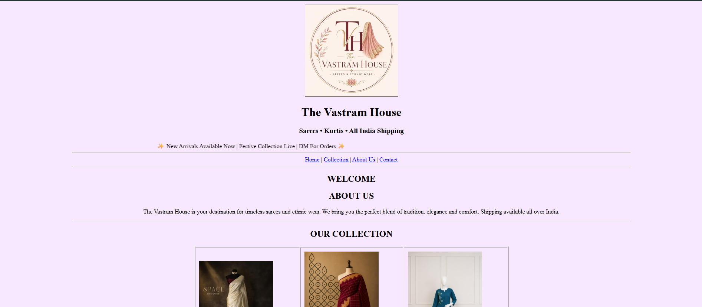
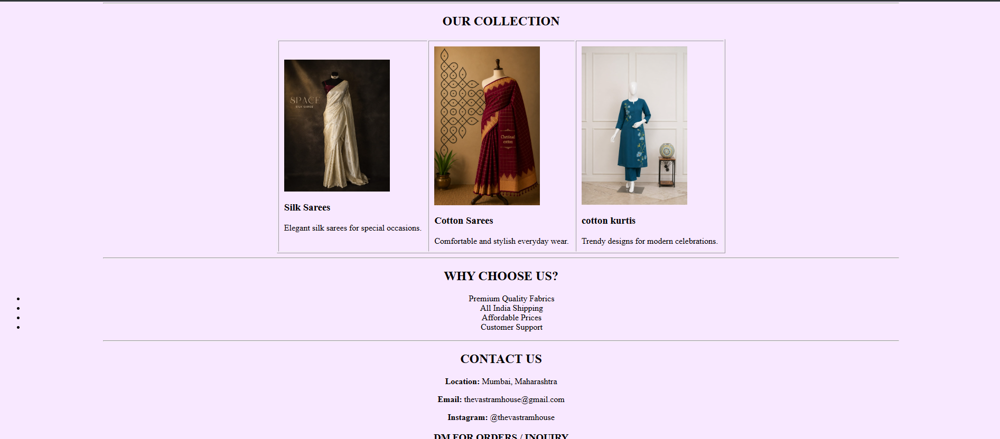
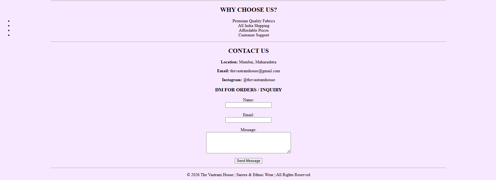

# Saree-website
# The Vastram House

## Description

The Vastram House is a simple HTML-based saree business website created as a beginner web development project. The website showcases saree collections, business information, customer reviews, and contact details.

## Features

* Saree business homepage
* Product collection display
* About Us section
* Customer reviews
* Contact form
* Business information

## Technologies Used

* HTML

## Website Preview

## Website Preview

## How to Run

1. Download the project files.
2. Open `index.html` in any web browser.
3. Explore the website.
